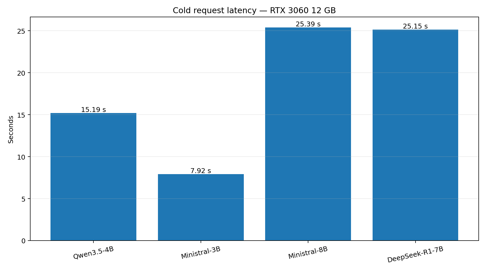
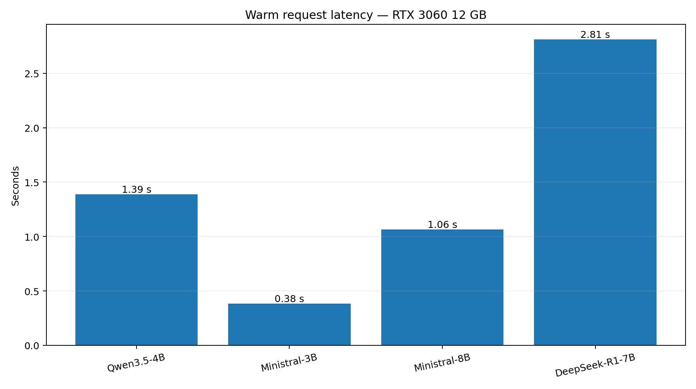

# Local LLM Stack Benchmark

**Hardware:** NVIDIA GeForce RTX 3060 12 GB

**Architecture:** Hermes → LiteLLM :4000 → llama-swap :8080 → llama.cpp

## Cold request

Cold timing includes model startup/loading plus inference. It is a practical stack-latency measurement, **not** a standardized tokens/sec benchmark.

| Model | Context | Cold |
|---|---:|---:|
| Qwen3.5-4B | 92K | 15.186 s |
| Ministral-3B | 64K | 7.922 s |
| Ministral-8B | 64K | 25.394 s |
| DeepSeek-R1-7B | 64K | 25.146 s |

## Warm request

One warm-up request was executed first. The measured request was the second request with the model already loaded.

| Model | Context | Warm |
|---|---:|---:|
| Qwen3.5-4B | 92K | 1.388538 s |
| Ministral-3B | 64K | 0.382149 s |
| Ministral-8B | 64K | 1.063998 s |
| DeepSeek-R1-7B | 64K | 2.810647 s |

## Notes

- Measurements represent this specific hardware and configuration.
- Measurements include the complete request path through LiteLLM and llama-swap.
- All four models returned HTTP 200.
- The full-stack test passed.
- DeepSeek-R1-7B returned `reasoning_content`.
- These results are intended as practical reference measurements, not as a universal performance ranking.
