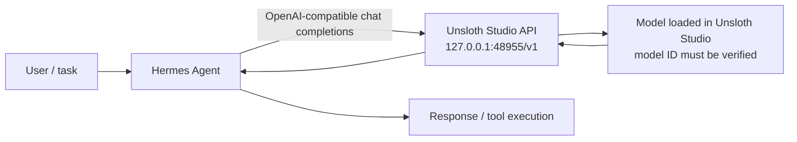

# Hermes + Unsloth Studio Bridge

Status: **planned / troubleshooting** (2026-10-10)

This is **architecture variant B**, separate from the existing
`Hermes → LiteLLM → llama-swap → llama.cpp` stack. The goal is to make
Hermes call a model served by Unsloth Studio directly through its
OpenAI-compatible API. Do not change or remove the older stack while
debugging this variant.

## Intended architecture

## Last known Hermes configuration

From `~/.hermes/config.yaml`, lines 75–81:

- `model.provider: custom`
- `model.default: ministral-8b`
- `model.base_url: http://127.0.0.1:48955/v1`
- `model.api_mode: chat_completions`
- An API key is configured locally. **Never copy it into documentation,
  GitHub, screenshots, or logs.**

The values above describe the configuration, not proof that the endpoint
is currently reachable or that `ministral-8b` matches the model ID exposed
by Unsloth Studio.

## Observed problem

Hermes reports:

`Provider temporarily unavailable — retrying automatically`

At the time this note was created, the endpoint check against
`http://127.0.0.1:48955/v1/models` had not yet been reported, so endpoint
availability and the correct model identifier remain unverified.

## Troubleshooting sequence

1. Check whether the configured API is reachable:
   `curl -sS --max-time 3 http://127.0.0.1:48955/v1/models`
2. If it fails, inspect Unsloth Studio's serving status and its actual API
   base URL. Do not guess a replacement port.
3. If it returns JSON, identify the exact model ID in the response.
4. Send a minimal chat-completions request to that endpoint.
5. Run a simple prompt through Hermes and confirm the response.
6. Only after the direct connection works, investigate timeouts, retries,
   tool calling, or other advanced behavior.

## Guardrails

- Keep this variant independent from LiteLLM and llama-swap.
- Do not start/stop or reconfigure the legacy services as part of this
  connection test unless a later diagnostic proves it is necessary.
- Do not start the separate Qwen3.6-35B experiment on port 8999 as part of
  this task; it is a different experiment.
- Make one small, read-only diagnostic change at a time.
- Never commit local API keys or other secrets.

## Success criteria

- The configured Unsloth endpoint responds at `/v1/models`.
- Hermes' configured model ID matches a model served by Unsloth Studio.
- A minimal direct API request returns an assistant response.
- Hermes completes a test prompt without the provider-unavailable retry.

See [CHECKLIST.md](CHECKLIST.md) for the operational checklist.
